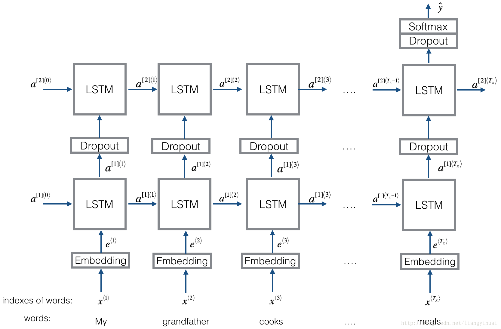

This repository contains the models for "Text-based Geolocation Prediction of Social Media Users with Neural Networks", IEEE BigData 2017
https://ieeexplore.ieee.org/document/8257985/  

## Models:
1. **Text CNN**    
  Implementation of [Convolutional Neural Networks for Sentence Classification](http://www.aclweb.org/anthology/D14-1181)  
  *Structure:*  
  Embedding --> Convolutional --> Max Pooling---> FC layer --> Softmax

2. **Text RNN**  
  Implementation based on model from [Emojifier-v2](https://blog.csdn.net/liangyihuai/article/details/79340738)  
  *Structure:*  
  Embedding --> Bi-directional LSTM --> Dropout --> Concat ouput --> LSTM --> Droput --> FC layer --> Softmax   

3. **Text RCNN**  
    Implementation of [Recurrent Convolutional Neural Network for Text Classification](https://www.aaai.org/ocs/index.php/AAAI/AAAI15/paper/download/9745/9552)  

    *Structure:*  
    Recurrent structure (convolutional layer) --> Max Pooling --> FC Layer --> Softmax   

    Learns representation of each word in the sentence or document with a left side context and a right side context.    
    representation current word=[ left_side_context_vector, current_word_embedding, right_side_context_vector ].    
    Uses a recurrent structure for the left side context; non-linear transformation for the previous word and a left side previous context.  

4. **FastText**    
Implmentation of [Bag of Tricks for Efficient Text Classification](https://arxiv.org/abs/1607.01759)   
    
    *Structure:*  
    After embedding each word in the sentence, the word representations are then averaged into a text representation, which is in turn fed to a linear classifier. Uses softmax function to compute the probability distribution over the predefined classes and a cross entropy is used to compute loss. Bag of words representation does not consider word order. Hence in order to take into account the word order, n-gram features are used to capture some partial information about the local word order; when the number of classes is large, computing the linear classifier is computationally  expensive; hence it hierarchical softmax to speed up the training process.

     * uses bi-gram and/or tri-gram
     * uses NCE loss to speed us softmax computation

5. **HierarchicalWithAttention**    
    Implementation of [Hierarchical Attention Networks for Document Classification](https://www.cs.cmu.edu/~diyiy/docs/naacl16.pdf)  
      
    *Structure:*  
      i) Embedding  
      ii) Word Encoder: word level bi-directional GRU to get rich representation of words  
      iii) Word Attention:word level attention to get important information in a sentence  
      iv) Sentence Encoder: sentence level bi-directional GRU to get rich representation of sentences  
      v) Sentence Attetion: sentence level attention to get important sentence among sentences  
      vi) FC+Softmax  

6. **BiLSTMTextRelation:**  
    Implementation based on Dual LSTM Encoder model from [The Ubuntu Dialogue Corpus: A Large Dataset for Research in Unstructured Multi-Turn Dialogue Systems](https://arxiv.org/abs/1506.08909)  

    *Structure:*  
    Embedding --> Bi-directional LSTM --> Dropout --> Concat ouput --> LSTM --> Droput --> FC layer --> Softmax   

7. **Seq2SeqAttn:**  
  Implementation seq2seq with attention derived from [NEURAL MACHINE TRANSLATION BY JOINTLY LEARNING TO ALIGN AND TRANSLATE](https://arxiv.org/pdf/1409.0473.pdf)   

    *Structure:*  
    Embedding --> Bi-directional GRU --> Decoder with attention  
      
    *Input Data:*  
    There are two kinds of three kinds of inputs:1)encoder inputs (a sentence),  2)decoder inputs(labels list with fixed length; 3)target labels, it is also a list of labels.     
    For example, labels is:"L1 L2 L3 L4", then decoder inputs will be:[_GO,L1,L2,L2,L3,_PAD]; target label will be:[L1,L2,L3,L3,_END,_PAD]. length is fixed to 6, any exceed labels will be trancated, will pad if label is not enough to fill.  
  
    *Attention Mechanism:*
    i) Transfer encoder input list and hidden state of decoder  
    ii) Calculate similiarity of hidden state with each encoder input, to get possibility distribution for each encoder input.    
    iii) Compute weighted sum of encoder input based on possibility distribution.    
    iv) Go though RNN Cell using this weight sum together with decoder input to get new hidden state    

    *How Vanilla Encoder Decoder Works:* 
    The source sentence will be encoded using RNN as fixed size vector ("thought vector").  
      
    During training, another RNN will be used to try to get a word by using this "thought vector" as init state, and take input from decoder input at each timestamp. decoder start from special token "_GO". after one step is performanced, new hidden state will be get and together with new input, we can continue this process until we reach to a special token "_END". we can calculate loss by compute cross entropy loss of logits and target label. logits is get through a projection layer for the hidden state(for output of decoder step(in GRU we can just use hidden states from decoder as output).

    During testing, there is no label. so we should feed the output we get from previous timestamp, and continue the process util we reached "_END" TOKEN.

8. **CNNWithAttn:**

## Usage:
1. Models are in

## Envionment:
python 2.7
Tensorflow 1.4.1
Numpy

## Reference:  
1.Bag of Tricks for Efficient Text Classification  

2.Convolutional Neural Networks for Sentence Classification    

3.A Sensitivity Analysis of (and Practitioners' Guide to) Convolutional Neural Networks for Sentence Classification  

4.Deep Learning for Chatbots, Part 2 – Implementing a Retrieval-Based Model in Tensorflow, from www.wildml.com    

5.Recurrent Convolutional Neural Network for Text Classification    

6.Hierarchical Attention Networks for Document Classification  

7.Neural Machine Translation by Jointly Learning to Align and Translate

